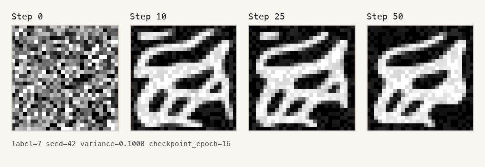

# sandbox-mnist

[](https://www.python.org/)
[](https://pytorch.org/)
[](https://huggingface.co/docs/datasets)
[](https://modal.com/)

**🔢 Noise-conditioned MNIST datasets and denoising experiments 🔢**



## Overview

### The Punchline

`sandbox-mnist` builds clean and Gaussian-noisy MNIST datasets for the Hugging Face Hub, then trains a compact PyTorch model to predict the exact additive noise field from each noisy digit.

### The Pain

MNIST is easy to load, but noise-prediction experiments need more than labels: they need reproducible corruptions, the original sampled noise tensor, the clean reference image, and metadata that ties each noisy example back to its source digit.

### The Solution

This repo packages that workflow into Python modules for dataset generation, local training, Modal GPU training, prediction visualization, and iterative denoising from random noise.

### The Result

The full local run in `runs/full_noise_predictor/metrics.json` trained on 270,000 examples, reserved 30,000 for validation, and reached `0.012790` best test MSE with `0.069108` best test MAE on the balanced noisy MNIST test split.

## Project Facts

| Area | Detail |
| --- | --- |
| Dataset shape | Clean MNIST plus Gaussian-noisy replicas with stored 28x28 noise maps |
| Default noisy dataset | 5 noisy copies per source image, variance schedule from `0.01` to `0.10` |
| Default split sizes | 60,000 clean train rows, 8,920 balanced clean test rows, 300,000 noisy train rows, 44,600 noisy test rows |
| Training target | Predict the sampled additive Gaussian noise from a noisy image conditioned on label and variance |

## Features

- **Hugging Face dataset builder** creates `mnist` and `mnist-gaussian-noisy` `DatasetDict` outputs with typed image, label, source index, replica, variance, and noise tensor columns.
- **Balanced test split** downsamples the MNIST test set to `892` examples per class before creating noisy replicas, keeping evaluation class-balanced.
- **Reproducible variance schedule** uses a seeded Gaussian sampler and linear variance schedule so noisy rows can be rebuilt deterministically.
- **Conditioned PyTorch model** concatenates noisy image pixels, one-hot digit label maps, and variance maps before predicting the full residual noise field.
- **Training metrics and checkpoints** write `best_val_model.pt`, `last_model.pt`, and `metrics.json` for each run under `runs/`.
- **Visualization tools** render noisy input, true noise, predicted noise, shared color scale, and prediction MAE into PNG artifacts.
- **Iterative sampling script** starts from random noise, repeatedly subtracts predicted residuals, and saves the denoising trajectory for a target label.
- **Modal training path** runs the same trainer on a Modal T4 GPU with outputs persisted to a Modal volume.

## Quick Start

### Use the published default dataset

The trainer falls back to the Hugging Face dataset repo `tsilva/mnist-gaussian-noisy` when `data/processed/mnist-gaussian-noisy` does not exist.

```bash
uv sync
uv run python -m mnist_hub.train_noise_predictor \
  --epochs 2 \
  --limit-train 512 \
  --limit-test 128 \
  --output-dir runs/readme-smoke
```

### Build datasets locally

```bash
uv run python -m mnist_hub.build_datasets --skip-push
```

This downloads MNIST through TorchVision and writes:

- `data/processed/mnist`
- `data/processed/mnist-gaussian-noisy`

To publish both datasets to your own Hugging Face namespace:

```bash
HF_TOKEN=hf_... uv run python -m mnist_hub.build_datasets \
  --namespace your-hf-name \
  --base-repo mnist \
  --noisy-repo mnist-gaussian-noisy
```

### Train locally

```bash
uv run python -m mnist_hub.train_noise_predictor \
  --dataset-path data/processed/mnist-gaussian-noisy \
  --output-dir runs/noise_predictor \
  --epochs 10 \
  --batch-size 256
```

### Train on Modal

```bash
uv run modal run src/mnist_hub/modal_train_noise_predictor.py \
  --run-name conditioned-variance-smoke \
  --epochs 10
```

Modal uses the app name `sandbox-mnist-noise-trainer`, a T4 GPU, and the persisted volume `sandbox-mnist-training`.

## Usage

### Render a prediction sample

```bash
uv run python -m mnist_hub.visualize_noise_prediction \
  --checkpoint runs/full_noise_predictor/best_val_model.pt \
  --split test \
  --index 0 \
  --output artifacts/full_run_best_prediction_sample.png
```

### Generate an iterative denoising grid

```bash
uv run python -m mnist_hub.iterate_conditioned_sampling \
  --checkpoint runs/full_conditioned_noise_predictor/best_val_model.pt \
  --label 7 \
  --variance 0.10 \
  --steps 10 25 50 \
  --output artifacts/conditioned_iterative_sampling.png
```

### Change the noisy dataset recipe

```bash
uv run python -m mnist_hub.build_datasets \
  --copies-per-example 8 \
  --variance-min 0.005 \
  --variance-max 0.15 \
  --seed 123 \
  --skip-push
```

## Dataset Schema

### Clean MNIST

| Column | Type | Meaning |
| --- | --- | --- |
| `image` | `Image` | 28x28 grayscale digit |
| `label` | `ClassLabel` | Digit class from `0` to `9` |
| `source_index` | `int32` | Original row index in the TorchVision MNIST split |

### Gaussian-noisy MNIST

| Column | Type | Meaning |
| --- | --- | --- |
| `image` | `Image` | Noisy 28x28 grayscale model input |
| `noise` | `Array2D(float32, 28x28)` | Sampled Gaussian noise before clipping |
| `raw_image` | `Image` | Clean MNIST reference image |
| `label` | `ClassLabel` | Digit class from `0` to `9` |
| `source_index` | `int32` | Original row index in the TorchVision MNIST split |
| `replica_index` | `int16` | Noisy copy number for the source image |
| `noise_variance` | `float32` | Gaussian variance used for this row |

## Architecture

```text
TorchVision MNIST
  -> src/mnist_hub/build_datasets.py
  -> data/processed/{mnist,mnist-gaussian-noisy}
  -> src/mnist_hub/train_noise_predictor.py
  -> runs/<run-name>/{best_val_model.pt,last_model.pt,metrics.json}
  -> src/mnist_hub/visualize_noise_prediction.py
  -> artifacts/*.png
```

The `NoisePredictor` model is a small convolutional network. Its input has `12` channels: one noisy image channel, ten label-condition channels, and one variance-condition channel. Its output is a single 28x28 predicted noise map.

## Project Structure

```text
src/mnist_hub/
  build_datasets.py                 # Build and optionally publish clean/noisy Hugging Face datasets
  train_noise_predictor.py          # Local PyTorch trainer and model definition
  modal_train_noise_predictor.py    # Modal GPU entrypoint
  visualize_noise_prediction.py     # Prediction comparison image renderer
  iterate_conditioned_sampling.py   # Iterative conditioned denoising renderer
runs/                              # Committed checkpoints and metrics from local experiments
artifacts/                         # Committed PNG outputs from dataset/model experiments
```

## Tech Stack

- [Python](https://www.python.org/) for the package and runnable experiment modules.
- [uv](https://docs.astral.sh/uv/) for lockfile-backed dependency installation and command execution.
- [PyTorch](https://pytorch.org/) and [TorchVision](https://pytorch.org/vision/stable/index.html) for MNIST loading, tensor training, checkpoints, and device selection.
- [Hugging Face Datasets](https://huggingface.co/docs/datasets) for typed dataset construction, disk serialization, Hub loading, and Hub publishing.
- [Pillow](https://python-pillow.org/) and [NumPy](https://numpy.org/) for image conversion, heatmaps, sampling, and artifact rendering.
- [Modal](https://modal.com/) for optional remote GPU training.

## Notes

- `data/`, `.venv/`, build outputs, and egg-info metadata are ignored by git.
- Hugging Face publishing requires `HF_TOKEN` or `--token`; local dataset generation works with `--skip-push`.
- Device selection accepts `auto`, `cpu`, `cuda`, or `mps`; `auto` prefers CUDA, then Apple MPS, then CPU.
- The noisy `image` column is clipped to `[0, 1]` after adding noise, while the `noise` column stores the original sampled Gaussian tensor before clipping.
- This repo does not currently define a test suite or console-script entry points in `pyproject.toml`.

## Support

Open an issue or send a PR if you want to extend the dataset recipe, add new corruption families, or compare additional denoising architectures.
